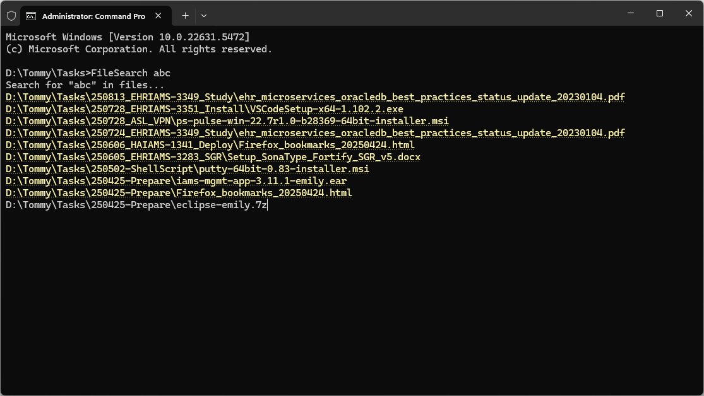

# File Search

This is a simple tool to search content of files. It search files in breadth-first order.



## Skip Pattern

Put a _config.json_ next to _FileSearch.exe_ and skip by pattern

```json
{
  "skip": ["\\\\.git$", "\\\\.svn$", "\\\\bin$", "\\\\obj$", "\\\\target$"]
}
```

## Add to PATH

I suggest adding to PATH so that you can search with `FileSearch` directly.

## File Search

If you would like to search file names only, checkout the sibling project

https://github.com/tommy-iasia/SearchFile 💛
